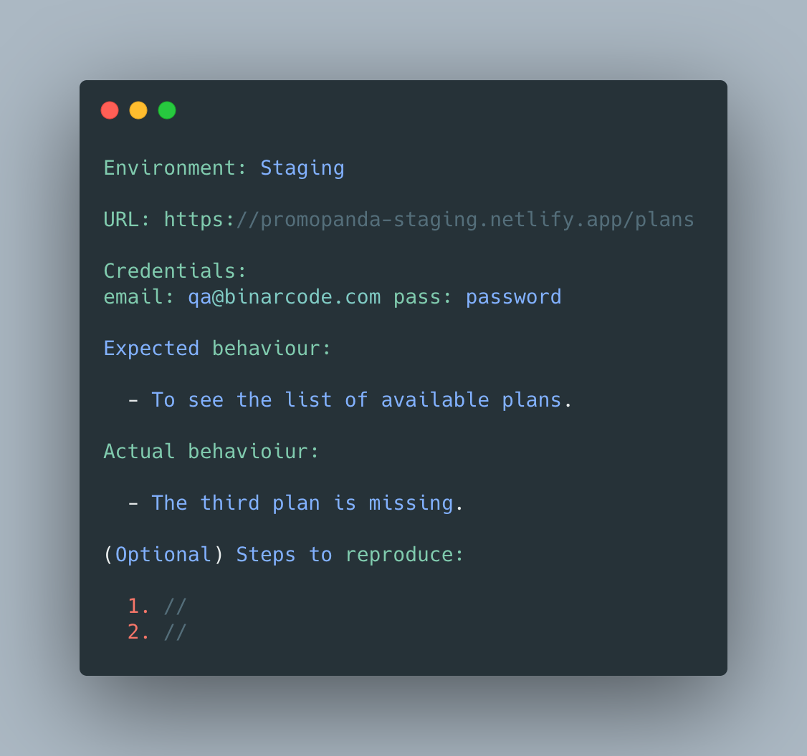

# TESTING PROCEDURES

Procedure to test a new project. Technical and management aspects.

[[toc]]

## Requirements analysis
- [ ] In case of converting a desktop app to a web app, documentation from the desktop app together with the new requirements are analysed
- [ ] In case of testing of an already developing project, gathering details about testing priorities (active sprint, priority features to be tested)
- [ ] Identify test environment details where testing is supposed to be carried out. 
- [ ] Automation feasibility analysis (if possible)

## Test Plan Creation
- [ ] Elaborate the strategy and the objectives of testing
- [ ] Schedule estimation based on requirements or previous experience from similar projects
- [ ] Determine Test Deliverables (different types of reports: test summary report, test incident report, test closure report, test status report, weekly status report)
- [ ] Resources: Make a list of Tools (Requirements Tracking Tool, Bug Tracking Tool, Automation Tools)
- [ ] Environment: Platform/ OS / Browsers

## Test Case Creation. A test case should contain following:  
- [ ] Test steps 
- [ ] Test data
- [ ] Preconditions
- [ ] Postcondition

## Test Case Execution
- [ ] execute the code using different black-box techniques established while analysing the risks (Equivalence partitioning, Boundary value analysis, Decision table testing)
- [ ] comparing the expected and actual result

## Defect Reporting - All defects reports should contain the following elements: 
- [ ] Unique identifier given to the defect. (Usually, automated)
- [ ] Project/Product Name 
- [ ] Release version of the product. (e.g. 1.2.3
- [ ] Specific module of the product where the defect was detected.
- [ ] Build version of the product where the defect was detected 
- [ ] Summary of the defect
- [ ] Detailed description of the defect. Describe as much as possible but without repeating anything or using complex words. Keep it simple but comprehensive.
- [ ] Steps to reproduce
- [ ] Actual Result and Expected Results
- [ ] Attachments(videos, screenshots, logs, etc)
- [ ] Severity and priority 
- [ ] Reported by (Usually, automated)
- [ ] Assigned To
- [ ] Status (When reported is set as open)

## Defect Re-verification and Regression 
- [ ] After the development team is changing a status of an issue from open to fix or ready for QA, this issue is re-verified to be sure it was indeed fixed
- [ ] Also Regression testing is performed in order to check if fixing an issue didn't affect other components of the app. 

## Test Closure 
- [ ] Check planned deliverables
- [ ] Close Incident Reports
- [ ] Handover to Maintenance
- [ ] Finalize & Archive Testware/Environment:
- [ ] Document System Acceptance
- [ ] Analysis Best Practices

<!--  -->

